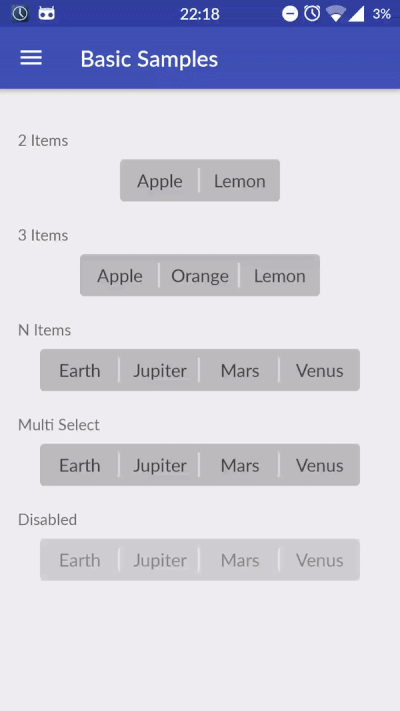
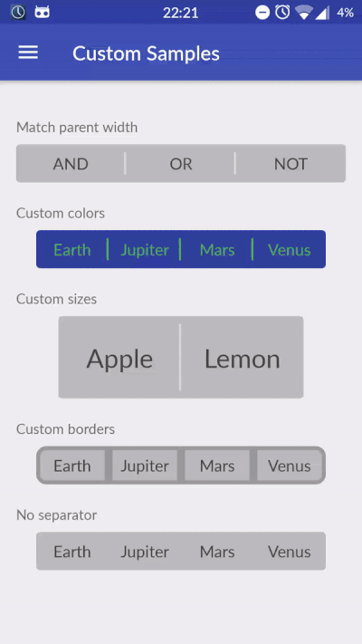
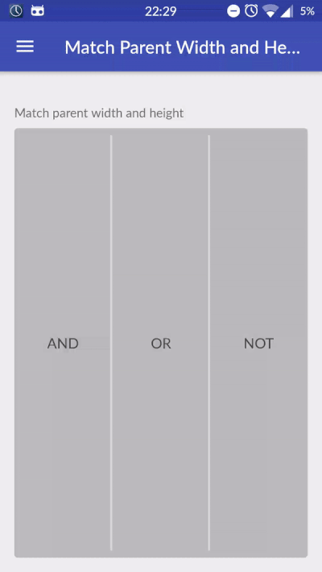
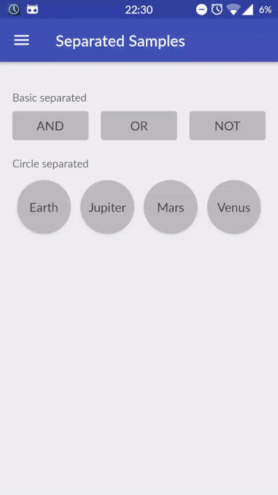

# Android-Toggle-Switch


[](http://android-arsenal.com/details/1/3235)


A customizable extension of Android Switches that supports also more than 2 items.


## Installation

#### Gradle
Add Gradle dependency:

```groovy
dependencies {
    compile 'us.belka:androidtoggleswitch:1.2.2'
}
```

#### Maven
```xml
<dependency>
  <groupId>us.belka</groupId>
  <artifactId>androidtoggleswitch</artifactId>
  <version>1.2.2</version>
  <type>pom</type>
</dependency>
```

## Basic Usage



#### 3 Items

```xml
<belka.us.androidtoggleswitch.widgets.ToggleSwitch
        android:layout_width="wrap_content"
        android:layout_height="wrap_content"
        custom:textToggleCenter="XOR"
        custom:textToggleLeft="OR"
        custom:textToggleRight="AND"/>
```

#### N - Items support

This can be accomplished in two ways:
* `xml`: In this way you have to define the `android:entries` attributes
as a `string-array`.
* `programmatically`: you have to set the entries as `List<String>`, `CharSequence[]`, etc.

XML
```xml
<belka.us.androidtoggleswitch.widgets.ToggleSwitch
        android:layout_width="wrap_content"
        android:layout_height="wrap_content"
        android:entries="@array/planets"/>
```

Programmatically
```java
ToggleSwitch toggleSwitch = (ToggleSwitch) findViewById(R.id.multiple_switches);
ArrayList<String> labels = new ArrayList<>();
labels.add("AND");
labels.add("OR");
labels.add("XOR");
labels.add("NOT");
labels.add("OFF");
toggleSwitch.setLabels(labels);
```

NOTE: Providing the entries using the `android:entries` attribute,
the attributes textToggle[Left/Center/Right] will be ignored.

#### Multiple checked items support

Simply use `MultipleToggleSwitch` instead of `ToggleSwitch`.

```xml
<belka.us.androidtoggleswitch.widgets.MultipleToggleSwitch
        android:id="@+id/multiple_toggle_switch"
        android:layout_width="wrap_content"
        android:layout_height="wrap_content"
        custom:textToggleCenter="Center"
        custom:textToggleLeft="Left"
        custom:textToggleRight="Right"/>                
```

## Getters and Setters


#### Toggle Switch

* `int getCheckedPosition()` Returns the current checked pos, -1 if none is checked.

```java
int pos = toggleSwitch.getCheckedPosition();
```

* `void setCheckedPosition(int pos)` Checks the pos passed as argument.

```java
int pos = 3;
multipleToggleSwitch.setCheckedPosition(pos);
```

#### Multiple Toggle Switch

* `List<Integer> getCheckedPositions()` Returns the list of the current checked positions

```java
List<Integer> checkedPositions = multipleToggleSwitch.getCheckedPositions();
```

* `void setCheckedPositions(List<Integer> checkedPositions)` Checks the pos passed as argument

```java
List<Integer> checkedPositions = new ArrayList();
checkedPositions.add(3);
checkedPositions.add(5);
multipleToggleSwitch.setCheckedTogglePositions(checkedPositions);
```

## Listeners


#### Toggle Switch

```java
toggleSwitch.setOnChangeListener(new ToggleSwitch.OnChangeListener(){
      @Override
      public void onToggleSwitchChanged(int position) {
	       // Your code ...
      }
  });
```

#### Multiple Toggle Switch

```java
multipleToggleSwitch.setOnChangeListener(new ToggleSwitch.OnChangeListener(){
      @Override
      public void onMultipleToggleSwitchChanged(int position, boolean checked) {
	       // Your code ...
      }
  });
```

## Customization




#### Border

It is possible to customize:
* the color of the border of both checked and unchecked buttons with `app:checkedBorderColor` and `app:uncheckedBorderColor` respectively
* the border width with the attribute `app:borderWidth`
* the border radius with the attribute `app:borderRadius`

Since by default the `borderWidth` is 0, it is important to set it at least
to `1dp` in order to show the border.

```xml
  <belka.us.androidtoggleswitch.widgets.MultipleToggleSwitch
      android:layout_width="wrap_content"
      android:layout_height="wrap_content"
      android:entries="@array/planets"
      app:borderRadius="8dp"
      app:borderWidth="4dp"
      app:checkedBorderColor="@color/teal"
      app:uncheckedBorderColor="@color/gray_border"/>
```

#### Color

It is possible to customize:
* the background color of both checked and unchecked buttons with `app:checkedBackgroundColor` and `app:uncheckedBackgroundColor` respectively
* the text color of both checked and unchecked buttons with `app:checkedTextColor` and `app:uncheckedTextColor` respectively

```xml
  <belka.us.androidtoggleswitch.widgets.ToggleSwitch
      android:layout_width="wrap_content"
      android:layout_height="wrap_content"
      android:entries="@array/planets"
      app:checkedBackgroundColor="@color/orange"
      app:checkedTextColor="@android:color/white"
      app:uncheckedBackgroundColor="@color/colorPrimaryDark"
      app:uncheckedTextColor="@color/green"
      app:separatorColor="@color/green"/>
```

#### Size

By default each button has a predefined width and height.
It is possible to customize both of them with the attributes `app:toggleWidth` and `app:toggleHeight` respectively.

NB. In order to let the attributes `app:toggleHeight` and `app:toggleWidth`to work
properly, it is **very** important to set the attributes `android:layout_height`
and `android:layout_width` setted as `wrap_content` respectively.

```xml
  <belka.us.androidtoggleswitch.widgets.ToggleSwitch
      android:layout_width="wrap_content"
      android:layout_height="wrap_content"
      app:textToggleLeft="@string/apple"
      app:textToggleRight="@string/lemon"
      android:textSize="26sp"
      app:toggleHeight="82dp"
      app:toggleWidth="122dp"/>
```

In fact, setting one of them to `match_parent` the respectively `app:toggle<Height/Width>`
will be ignored since the following cases happen:
* `android:layout_width=match_parent` then the parent's width is distributed evenly
between the buttons.
* `android:layout_height=match_parent` then each button takes all the parent view height.

An example of setting both attributes to `match_parent` is shown below.



#### Programmatically Customization

All customizations can be done also programmatically.
Once all the properties has been properly set, it's necessary
to call the method `reDraw()`

## Separated Buttons

In order to create separated buttons, just set the `android:toggleMargin` attribute
with a value (in `dp`) greater than 0.

An example of separate toggle buttons is shown below.



## Custom View


## Bonus

#### Disabled

In order to disable the toggle switch buttons:
* **xml**: set the attribute `android:enabled=false`
* **programmatically**: ```java toggleSwitch.setEnabled(false)```

#### Elevation

Set the attribute: `android:elevation=<dimension_dp>`

## Attributes

It is possible to customize the buttons applying the following options:


| Option Name      				       | Format          | Description                                      |
| ---------------- 				       | --------------  | -----------------------------                    |
| android:enabled 				       | `boolean`  	   | Enable or disable the toggle switch buttons      |
| android:entries 				       | `array`  	     | Set the labels of each button                    |
| android:textSize 				       | `dimension`  	 | Text size of each button                         |
| custom:checkedBackgroundColor  | `color`         | Background color of a checked button             |
| custom:checkedBorderColor      | `color`         | Border color of a checked button                 |
| custom:checkedTextColor        | `color`         | Text color of a checked button                   |
| custom:borderRadius			       | `dimension`	   | The border radius of each button in dp           |
| custom:borderWidth             | `dimension`     | The width of the border of each button in dp     |
| custom:uncheckedBackgroundColor| `color`		     | Background color of the unchecked buttons        |
| custom:uncheckedBorderColor    | `color`         | Border color of a unchecked button               |
| custom:uncheckedTextColor      | `color`         | Text color of the unchecked buttons              |
| custom:separatorColor          | `color`         | Color of the vertical separator between buttons  |
| custom:separatorVisible        | `boolean`       | Set if the separator is visible or not           |
| custom:toggleMargin    		     | `dimension`     | Margin between each button in dp                 |
| custom:toggleHeight    		     | `dimension`     | Height of each button                            |
| custom:toggleWidth    		     | `dimension`     | Width of each button                             |


## Contributors
Lorenzo Rigato,
Fabrizio Rizzonelli, Android Developer @[Belka](https://github.com/BelkaLab)

## License
Android-Toggle-Switch is Copyright (c) 2016 Belka, srl. It is free software, and may be redistributed under the terms specified in the LICENSE file.  

## About Belka


[Belka](http://belka.us/en) is a Digital Agency specialized in design, mobile applications development and custom solutions.
We love open source software! You can [see our projects](http://belka.us/en/portfolio/) or look at our case studies.

Interested? [Hire us](http://belka.us/en/contacts/) to help build your next amazing project.

[www.belka.us](http://belka.us/en)
